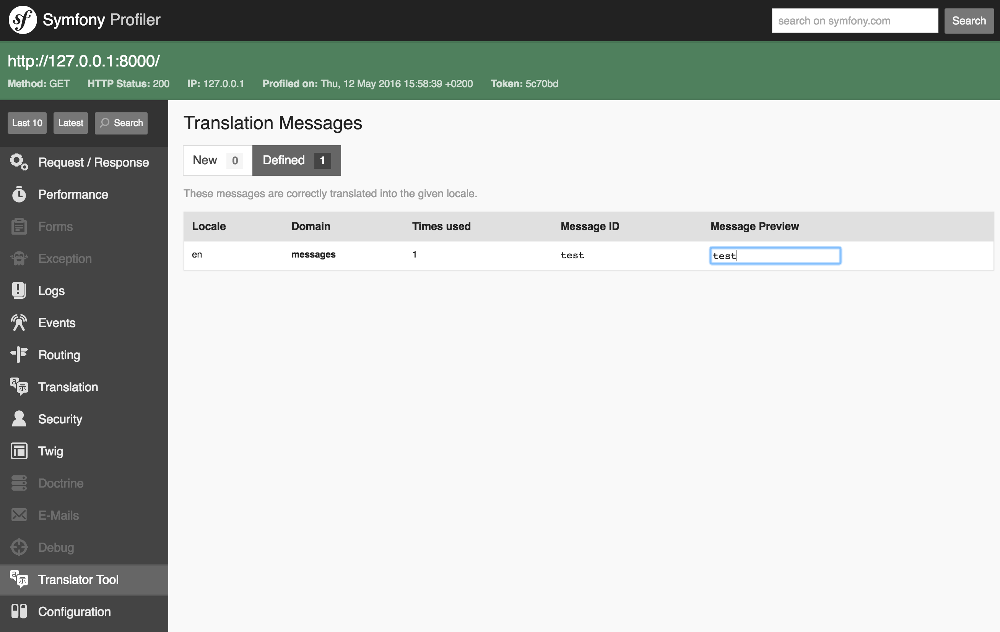

AECF/TranslatorToolBundle
=============

The TranslatorToolBundle adds a symfony profiler tool.

Features:

- Automatically adds your keys followed by "trans" twig filter in the translation file (create if it does not exist).
- Adds an interface to add or edit translations, just click on your word in the "Message Preview" column (if you aren't in live edit), type your word and click outside the field.
- Only the language of your current environment will be impacted.

**Note:** This bundle does *not* provide an translation system but make it easier

[](https://travis-ci.org/Aecf/TranslatorToolBundle)

Installation
------------

You can install Slugify through [Composer](https://getcomposer.org):

```shell
$ composer require aecf/translator-tool
```

#### Enable translation:
In your app/config/config.yml, just uncomment:

    framework:
        translator: { fallbacks: ["%locale%"] }

#### Enable the bundle:

app/AppKernel.php:

```php
if (in_array($this->getEnvironment(), array('dev', 'test'))) {
    ...
    $bundles[] = new AECF\TranslatorToolBundle\TranslatorToolBundle();
}
```

routing_dev.yml:

```yml
translator_tool:
    resource: "@TranslatorToolBundle/Controller/"
    type:     annotation
    prefix:   /translator_tool/
```

config_dev.yml:

```yml
translator_tool:
    enabled_locales: ['fr', 'en'] # optional, if not specified default value is parameter "locale"
    live_edit: true
    auto_create_missing:
        enabled: true
        formats: ['yml'] # Supported formats : csv, ini, json, mo, php, po, yml, xml
```

Result
------



License
-------

This bundle is under the MIT license. See the complete license in the bundle:

    Resources/meta/LICENSE

About
-----

TranslatorToolBundle is a [AECF](https://github.com/Aecf) initiative.

AECF = Auchan E-Commerce France.

See also the list of [contributors](https://github.com/Aecf/TranslatorToolBundle/contributors).

Reporting an issue or a feature request
---------------------------------------

Issues and feature requests are tracked in the [Github issue tracker](https://github.com/Aecf/TranslatorToolBundle/issues).

When reporting a bug, it may be a good idea to reproduce it in a basic project
built using the [Symfony Standard Edition](https://github.com/symfony/symfony-standard)
to allow developers of the bundle to reproduce the issue by simply cloning it
and following some steps.
